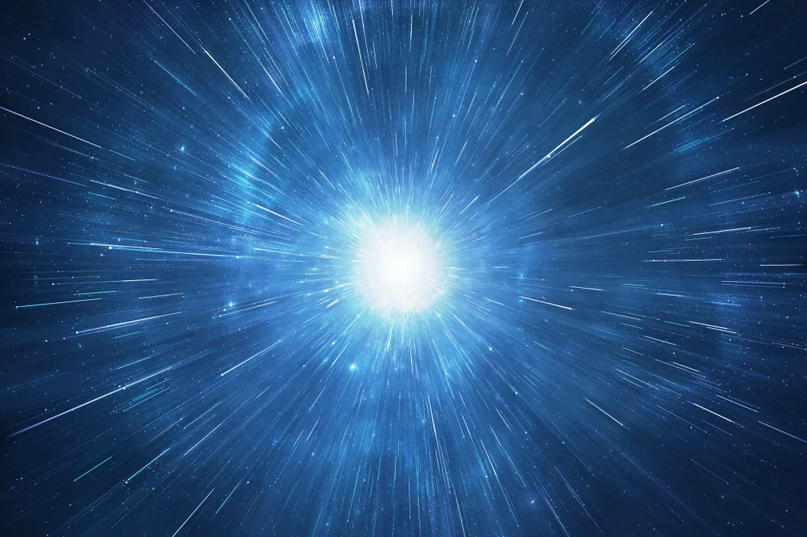

# If THE CREATOR : ALLAH Gives Permission 6 Degrees of Freedom Color Sphere Range > "Sky Girdle"

Rahman ve Rahim olan ALLAH’ın adıyla;

61:8 İstiyorlar ! onlar için söndürmeyi onu nur ALLAH ile pro nüanslar (ayrımlar : color gamut profilleriyle - üzülüyorlar renkten gamlanıyorlar) ve ALLAH tümleyen nurunu velev bulsa zor iğrense küfredenler! 

SUBHAN OLAN RABBİMİZ EN AZİM,
eksiklikten UZAK OLAN SAHİBİMİZ EN BÜYÜK,
YÜCELERİN EN YÜCESİ OLAN EFENDİMİZ EN AZİM BAĞIŞ SAHİBİ,
SUBHAN OLAN RABBİMİZ EN KARARLI,
YÜCELERİN EN YÜCESİ OLAN EFENDİMİZ EN KUTSAL,
eksiklikten UZAK OLAN Rabbimiz EN ALA OLAN;
YARATAN HALIK FATIR RAHMAN VE RAHİM OLAN ALLAH'IMIZ NURUNU TAMAMLAYACAK!

KURAN 61:14
FURKAN 13:68

Some inmature attemtpts :

https://www.amazon.co.uk/Romanticism-Jean-Clay/dp/0865650128/

https://en.wikipedia.org/wiki/Philipp_Otto_Runge#cite_note-Clay_(1981)-8

https://en.wikipedia.org/wiki/Munsell_color_system
